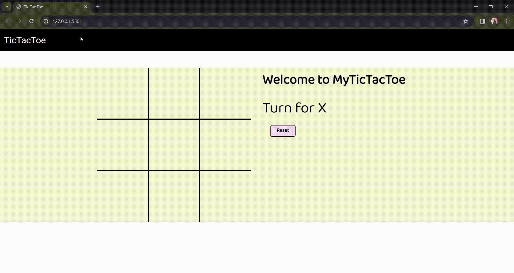

# Tic Tac Toe Game

A simple and interactive Tic Tac Toe game built with HTML, CSS, and JavaScript. Enjoy the classic game with a clean and user-friendly interface.

## Demo

 <!-- Replace with the path to your screenshot -->

## Features

- **Responsive Design:** Play on any device with a responsive layout.
- **Easy-to-Use Interface:** Intuitive design for a seamless gaming experience.
- **Multiplayer:** Play against a friend locally and see who's the Tic Tac Toe champion.
- **Clean Code:** Readable and well-organized code for easy understanding and future development.

## 🛠 Technologies Used

- HTML
- CSS
- JavaScript
- 

## How to Play

1. Clone the repository:
     git clone [Click here..](https://github.com/Sourav-Sir/Tic-Tac-Toe/tree/main/tic%20tac%20toe)
   
     2. Open [index.html](https://github.com/Sourav-Sir/Tic-Tac-Toe/blob/main/tic%20tac%20toe/index.html) in your preferred browser.
